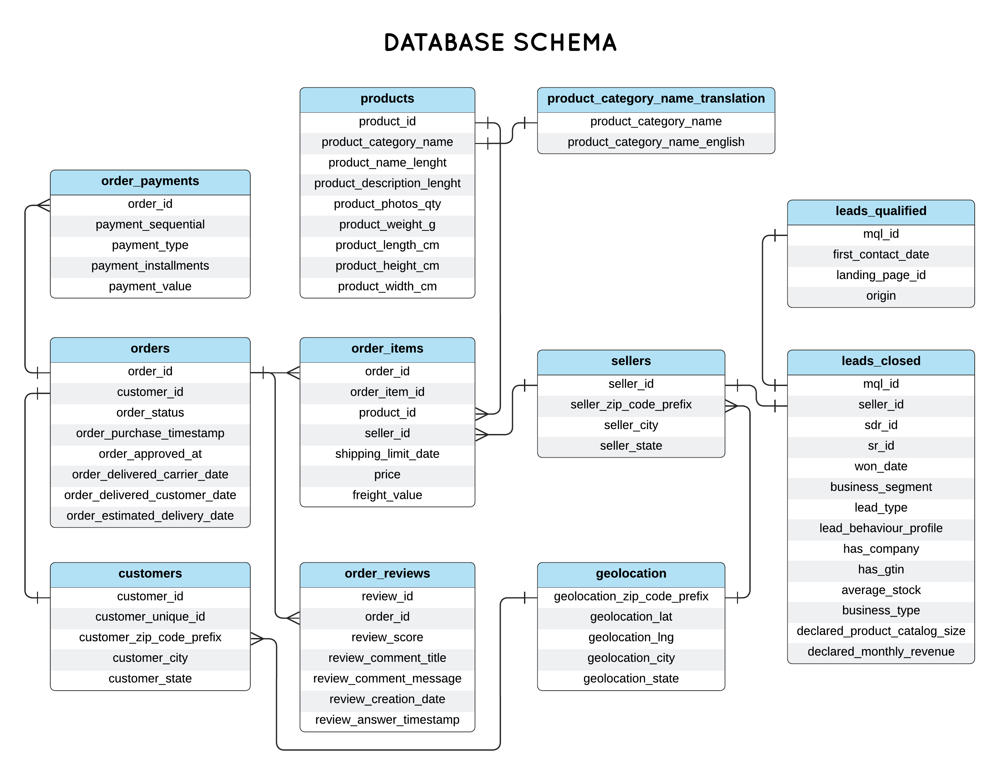

# 📊 SQL Business Analysis — Olist E-Commerce Database

## 🎯 Business Context
A Brazilian e-commerce company wants to understand its business performance 
through data. As the data analyst, I answer critical business questions 
using SQL on a normalized relational database with 8 interconnected tables 
and 100K+ orders.

This project demonstrates SQL fluency — translating real business 
questions into efficient queries using JOINs, CTEs, subqueries, 
aggregations, window functions, and date logic.

## 🗄️ Database Schema

## 🔧 Tools Used
- **Database:** PostgreSQL
- **SQL Client:** DBeaver
- **Concepts:** JOINs, CTEs, GROUP BY, CASE WHEN, Date Functions, 
  Window Functions, Subqueries

## 📋 Business Questions & Queries

### Completed ✅

| # | Business Question | Key Concept|

| 01 | What is the month-over-month revenue growth rate? | DATE_TRUNC, LAG, CTE 

| 02 | What is the running total of revenue by month? | SUM() OVER(ORDER BY)

| 03 | Rank products within each category by total revenue | RANK(), PARTITION BY 

| 04 | For each customer, what was the time gap between their 1st and 2nd order?

| 05 | What percentage of total revenue does each product category represent? 

| 06 | Which customers have made purchases in 3+ consecutive months? | DATE logic, Consecutive detection 

| 07 | What is the 3-month moving average of revenue? | AVG() OVER(ROWS BETWEEN) 

| 08 | Identify customers whose AOV has decreased over their last 3 orders vs first 3

